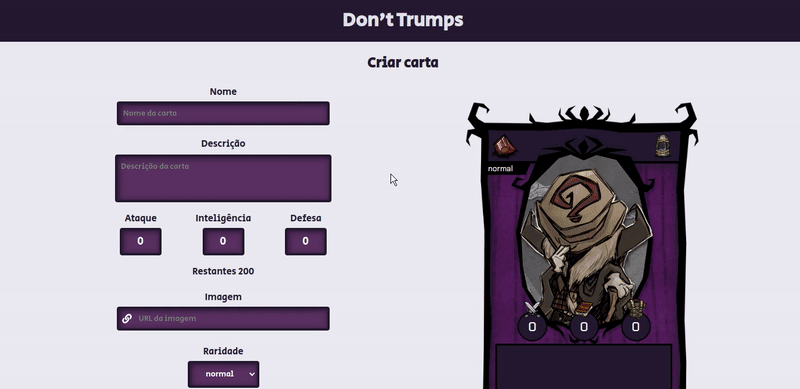
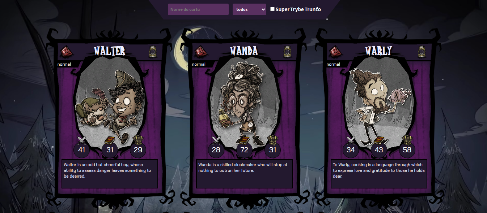
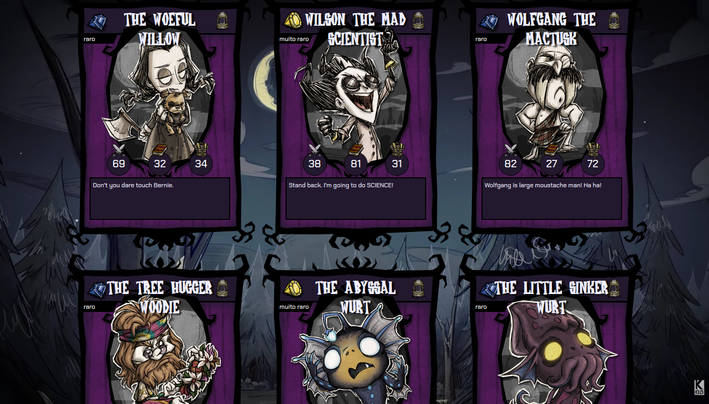
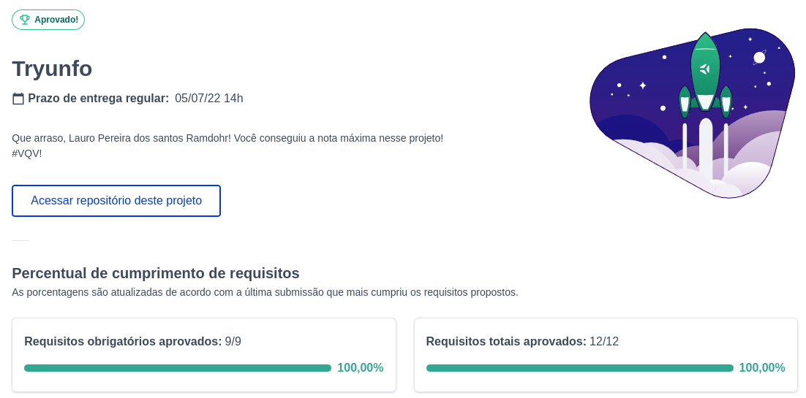

# :open_umbrella: Don't Trumps

## Acesse meu projeto <a href="https://lauropera.github.io/dont-trumps/">AQUI</a>

## :satellite: Desenvolvimento

Projeto desenvolvido na <a href="https://betrybe.com/" target="_blank">Trybe</a> durante o módulo de Front-End!

Nesse projeto desenvolvemos uma aplicação de um jogo no estilo Super Trunfo. Era necessário que nós manipulasse o estado da nossa aplicação e as propriedades de um componente.

Vou continuar evoluindo ele com o tempo!

## :hammer_and_wrench: Tecnologias

* HTML
* CSS
* JavaScript
* React.js

# :iphone: Mobile
​

# :camera: Screenshots

## :heavy_check_mark: Nota

